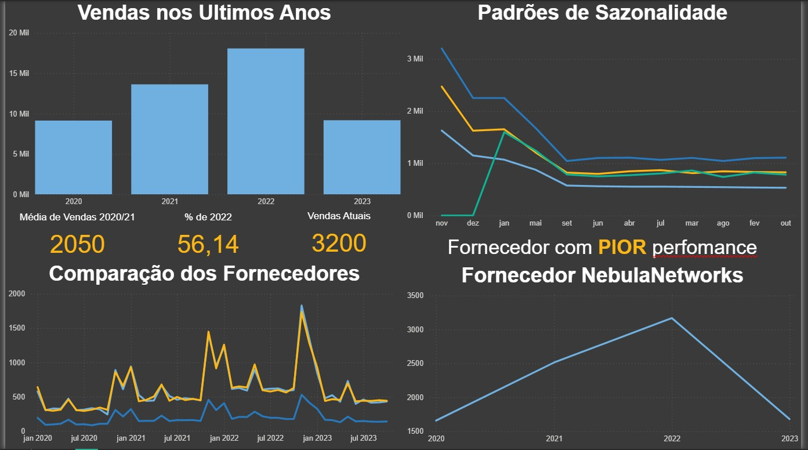

# 📊 Análise de Dados com SQLite e Power BI

Este projeto tem como objetivo realizar uma **análise exploratória e comparativa de vendas e fornecedores** utilizando **SQLite Online** para consultas SQL e **Power BI** para a construção de dashboards interativos e visualização dos dados.  

Com isso, foi possível identificar padrões de sazonalidade, médias de vendas, comparações entre fornecedores e destacar o fornecedor com a pior performance.

---

## 🚀 Funcionalidades do Projeto
- Consulta e tratamento dos dados em **SQLite**.
- Cálculo de **média de vendas** nos anos anteriores.
- Identificação do **percentual de participação** do ano de 2022.
- Comparação detalhada entre **fornecedores**.
- Análise de **sazonalidade** das vendas.
- Criação de **dashboard interativo no Power BI**.
- Destaque para o **fornecedor com pior performance**.

---

## 🛠️ Competências Desenvolvidas
✅ Manipulação de dados com **SQL (SQLite)**  
✅ Criação de **consultas analíticas** e comparativas  
✅ **Visualização de dados** com Power BI  
✅ Interpretação de métricas e indicadores  
✅ Aplicação de **lógica de negócios** em análise de dados  

---

## 📸 Visualização do Dashboard

---

## 📂 Estrutura do Projeto
- `queries.sql` → Arquivo com as consultas utilizadas no SQLite Online.  
- `Dashboard_Dados.pbix` → Arquivo do Power BI com as análises visuais.  
- `Dash_visualizacao.jpg` → Print do dashboard com os principais insights.  
- `README.md` → Documentação do projeto.  

---

## 📌 Tecnologias Utilizadas
- **SQLite Online** → para consultas SQL  
- **Power BI** → para visualização e análise interativa  

---

## ✨ Autor
👩‍💻 **Monniky Ribeiro**  
📎 [LinkedIn](https://www.linkedin.com/in/monnikys)
